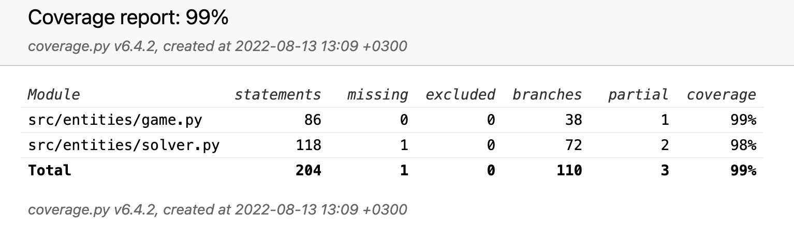

# Testing Document

## Unittests
The project contains unittests that cover each class responsible for the game logic. These classes are Solver and Game. The unittests try to test both simple cases and corner cases of the methods in each of these classes. 

All the unittests can be run using command `pytest src` from the root of the project. It takes around 25 seconds to run all the tests.

### Game-class
In the Game-class the most important unittests are the tests that check if the puzzle is solvable. As input I have used in these tests three boards that I know for a fact that are solvable and two boards that I know for a fact that are not solvable. The Game-class passes both of these cases. In the Game-class there are also smaller tests for methods that the class uses in the method that checks the solvability. This way I can be sure that also the helper functions work as they are intended to work.

### Solver-class
In the Solver-class the most important tests test the solving of the Puzzle and its helper functions. The solving of the puzzle is tested with three different levels for the inputs: easy, intermediate, and hard. In the easy-level the puzzle is solvable with only few moves. In the intermediate-level the puzzle is solvable in reasonable time. In the hard-level the input is a board obtained from random-shuffle and this is only tested with the improved Manhattan-distance heuristic. The solving of the puzzle requires many helper functions and therefore the correct functionality of these functions is extremely important. For example the testing of possible boards from the current board is done using three different cases: case where the blank tile is on the side, case where the blank tile is in a corner and case where the blank tile is in the middle of the board. In addition, the implementation for each heuristic is separately tested using inputs where I have calculated the correct heuristic value.

## Performance testing
The performance of the three heuristics, Manhattan-, Hamming-, and improved Manhattan-distance, can also be tested. With this performance testing the user can get a better understanding of how the different heuristics perform when solving the 15 Puzzle using IDA*. The performance testing includes two different levels of input boards and the program calculates the average duration in solving these boards using 100 iterations.

The output from running the performance test:<br>
```console
Testing performance with an easy initial board...
Average durations:
Manhattan: 0.0001045513s
Hamming: 0.0000951052s
Improved Manhattan: 0.0003309250s

Testing performance with an intermediate initial board...
Average durations:
Manhattan: 0.1641170239s
Hamming: 0.7497469068s
Improved Manhattan: 0.1068987012s
```

The performance testing can be run using command `python src/performance_testing.py` from the root of the project. It takes around 2 minutes to run the script.

### Empirical Testing
I have also tested empirically the performance of the heuristics by running the program on easy-mode ten times for each heuristic. Below you can see the number of times the algorithm could not solve the puzzle in under two minutes for each heuristic:<br>
- Manhattan: 1
- Hamming: 4
- Improved Manhattan: 3

Based on the empirical testing it seems that the most problematic initial board for every heuristic was a board where the blank tile was in the correct position. With other initial boards the algorithm could solve the "easy"-mode puzzle in under one second regardless the used heuristic.

## Test Coverages

### Week 2


### Week 3


### Week 4


### Week 5


### Week 6
